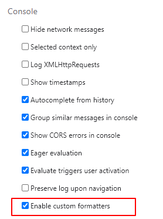

# 第2章 框架（Vue.js）设计的核心要素

**1. 提升用户开发体验**
   
   - 提供友好的警告信息
   
   - 定义友好的浏览器输出形式
   
   Vue.js 3 提供了友好的 formatter，以 Chrome 浏览器为例，打开 DevTools 的设置，勾选 ”Console“ -> ”Enable custom formatters“。
   
   
   
   控制台打印数据：
   
   ```js
   const count = ref(0)
   console.log(count)
   ```
   
   默认：
   
   
   
   启用 formatter：
   
   
   
   可以看到，控制台打印的信息更加直观。

**2. 控制代码体积——区分开发环境和生产环境**

**3. Tree-shaking——剔除不需要的代码**

**4. 不同类型的输出产物——cjs 和 esm（esm-browser.js 和 esm.bundle.js）**

**5. 提供统一的错误处理接口（`app.config.errorHandler`）**

**6. 良好的 TypeScript 支持**