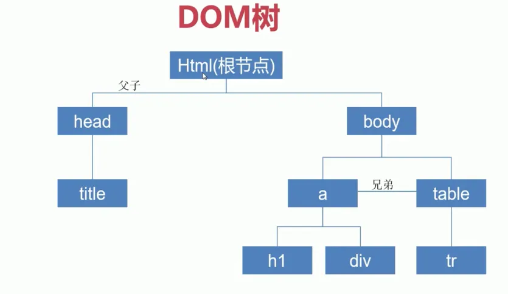

# 第 1 章 权衡的艺术

## 1. 命令式框架和声明式框架

| 框架   | 关注点                         | 示例   | 性能                                                                                                               | 可维护性               |
| ------ | ------------------------------ | ------ | ------------------------------------------------------------------------------------------------------------------ | ---------------------- |
| 命令式 | **过程**                       | jQuery | 更好                                                                                                               | 较差，需要关注整个过程 |
| 声明式 | **结果**（过程由框架内部实现） | Vue.js | 不优于命令式，因为<br />**声明式代码的更新性能消耗=找出差异的性能消耗+直接修改的性能消耗（命令式代码的更新消耗）** | 较好，只关注结果       |

## 2. DOM ，虚拟 DOM 和 innerHTML

### DOM

DOM（Document Object Model，文档对象模型）指的是页面多层节点构成的文档结构。一个 HTML 文档可以被解析为一颗 DOM 树，每个标签即为一个节点，对节点的查询、插入、删除等操作被称为 DOM 操作，DOM 操作是比较耗费性能，尤其是频繁的 DOM 操作。



### 虚拟 DOM

虚拟 DOM，就是一个描述真实 DOM 结构的 JavaScript 对象，例如：

```html
<div>
  <span>text</span>
</div>
```

可以映射为：

```js
{
    tag: 'div',
    children: [
        { tag: 'span', children: 'text' }
    ]
}
```

当我们需要更新节点时，并不是直接操作 DOM，而是先通过 `diff` 函数找到需要更新的部分，然后再渲染。结合上一节的内容，**声明式代码的更新性能消耗=找出差异的性能消耗+直接修改的性能消耗**，原生 DOM 操作即为命令式代码，虚拟 DOM 的作用则是为声明式代码**最小化**找出差异的性能消耗。

### innerHTML

通过 innerHTML 操作页面，首先需要把字符串解析为 DOM 树，这个过程是全量更新的，即销毁所有旧 DOM 和新建所有新 DOM，这意味着更新时的性能消耗是比较大的。

|             原生 DOM 操作              |                 虚拟 DOM                 |        innerHTML         |
| :------------------------------------: | :--------------------------------------: | :----------------------: |
| 心智负担大<br />可维护行差<br />性能高 | 心智负担小<br />可维护性强<br />性能不错 | 心智负担中等<br />性能差 |

## 3. 运行时和编译时

详见：第 3 章 Vue.js 的设计思路-声明式描述 UI。

[第 2 章 框架（Vue.js）设计的核心要素 ↓](./第2章%20框架（Vue.js）设计的核心要素.md)
